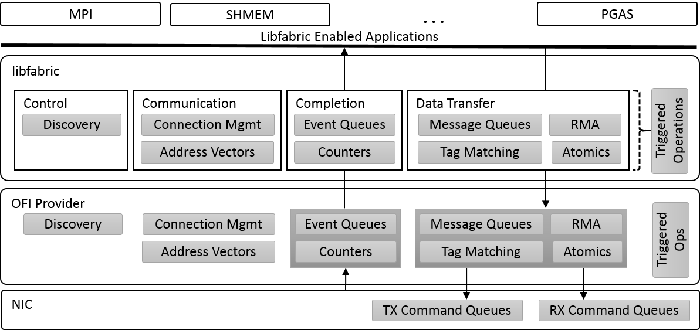
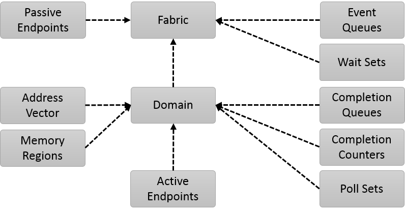
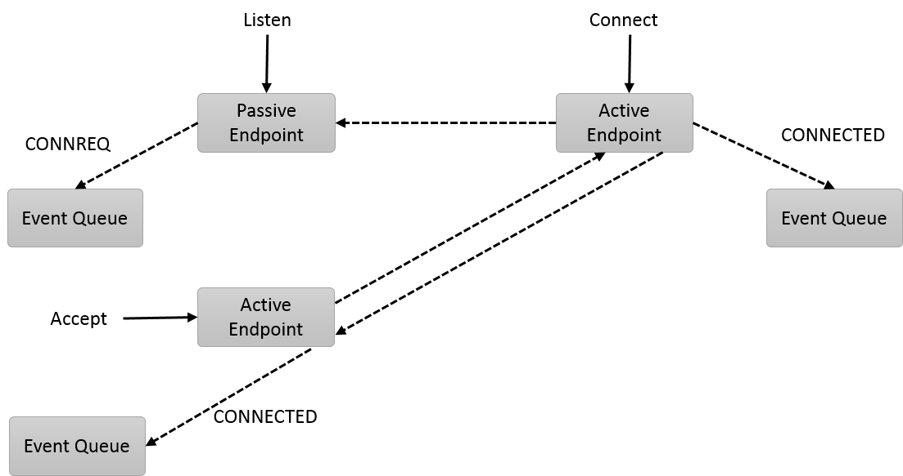
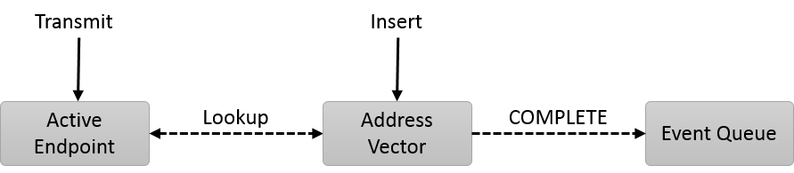
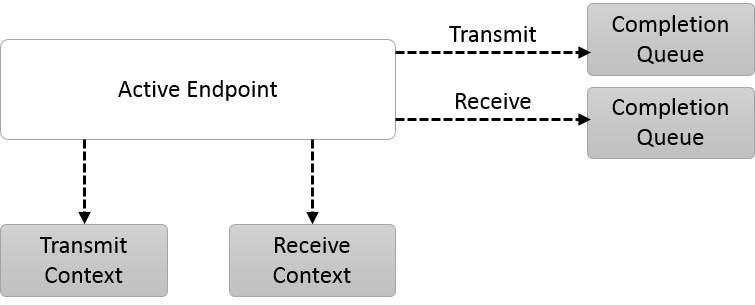
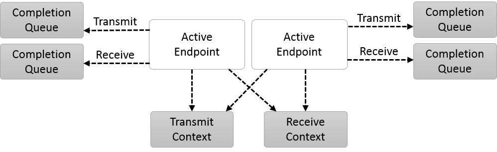
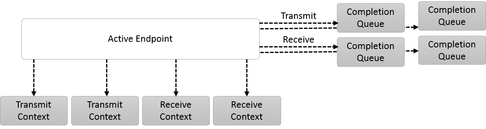

# Термины

**Fabric Computing**  - создание и эксплуатация вычислительной структуры, состоящей из взаимосвязанных узлов, которые выглядят с точки зрения топологии как «переплетение» или «матрица» (fabric).
**OpenFabric Intrefaces (OFI)** - это фреймворк, предназначенный для предоставления коммуникационного сервиса устройств высокоскоростных сетей приложениям. OFI специально разработан для удовлетворения требований к производительности и масштабируемости приложений высокопроизводительных вычислений (HPC).
**Libfabric** - ключевой компонент OFI. Это библиотека, которая определяет и экспортирует API пользовательского пространства OFI и, как правило, является единственным программным обеспечением, с которым приложения имеют дело напрямую. Libfabric не зависит от базовых сетевых протоколов, а также от реализации конкретных сетевых устройств.

# Введение

Цель OFI, в частности libfabric, заключается в том, чтобы определить интерфейсы, которые обеспечивают плотную семантическую карту между приложениями и базовыми сервисами устройств. В частности, программные интерфейсы libfabric были разработаны совместно с разработчиками аппаратного обеспечения и разработчиками приложений с акцентом на потребности HPC.

Этот документ описывает архитектуру и некоторые интерфейсы libfabric, дает представление о мотивах дизайна libfabric на основании соответствующего руководства [1][1].

Документ использует материалы "Libfabric (v1.4) Programmer's Guide" и материалы OpenFabrics Interfaces Working Group [2][2].

# Обзор коммуникации по сокетам

API сокетов является широко используемым сетевым API. В официальном руководстве по libfabric даются отсылки на сокетную коммуникацию, чтобы помочь объяснить принципы libfabric. Ниже приведены некоторые выдержки из этих объяснений.

## Преимущества API сокетов

API сокетов имеет два существенных преимущества:
 - Во-первых, он доступен для широкого спектра операционных систем и платформ и работает с подавляющим большинством доступного сетевого оборудования. Это де-факто базовый сетевой API. Это само по себе делает его привлекательным для использования.
 - Второе ключевое преимущество заключается в том, что сокеты относительно легко программировать. Важность этого не следует преуменьшать. Сетевые API-интерфейсы, которые предоставляют доступ к высокопроизводительным функциям, но которые трудно  правильно программировать, часто приводят к снижению производительности приложений. **Приложения должны иметь четкую потребность в высокопроизводительной сети, прежде чем выбирать API альтернативный сокетам.**

## Недостатки API сокетов

Рассматривая проблемы с API сокетов целесообразно ограничить обсуждение двумя наиболее распространенными типами сокетов: TCP и UDP.

Большинство приложений требуют, чтобы сетевые данные были отправлены надежно. Это неизменно означает использование ориентированного на соединение сокета TCP. TCP-сокеты передают данные в виде потока байтов. Однако многие приложения работают с сообщениями. В результате приложения часто вставляют заголовки, которые просто используются для преобразования в/из потока байтов. Эти заголовки потребляют дополнительную пропускную способность сети и требуют обработку. Потоковая природа интерфейса также приводит к тому, что приложение использует циклы для отправки и получения больших сообщений. Сложность этих циклов может быть значительной, если приложение управляет сокетами для сотен или тысяч узлов.

Другая проблема связана с асинхронной природой сетевого трафика. При использовании надежного транспорта недостаточно поместить данные приложения в сеть. Если сеть занята, она может отбросить пакет или данные могут быть повреждены во время передачи. Данные должны храниться до тех пор, пока узел не подтвердит их получение, чтобы при необходимости их можно было повторно отправить. API сокета построен так, что приложение возвращает свои буфера памяти сразу после возврата из системного вызова.

Например, если мы рассмотрим вызов сокета send(), то когда send() вернет управление приложению, приложение может свободно изменять свой буфер. Реализация сети имеет несколько вариантов. Одним из вариантов является отправка вызова для помещения данных непосредственно в сеть. Затем вызов должен блокироваться перед возвратом пользователю, пока партнер не подтвердит, что он получил данные, после чего send() может вернуть управление приложению. Очевидная проблема этого подхода заключается в том, что приложение блокируется в вызове send() до тех пор, пока сеть не сможет обработать данные и сгенерировать подтверждение доставки. Это может занять значительное количество времени, приложение блокируется и не может выполнять другую работу, например обрабатывать сообщения других клиентов.

Лучшим вариантом для вызова send() оказалось копирование данных приложения во внутренний буфер. Передача данных затем осуществляется из этого буфера, что позволяет повторить операцию в случае сбоя. Вызов send() в этом случае не блокируется, но все данные, которые проходят через сеть, **приведут к копированию памяти в локальный буфер**, даже при отсутствии каких-либо ошибок.

Возможность немедленного повторного использования буфера данных помогает поддерживать простой API сокетов. Однако такая функция может оказать негативное влияние на производительность сети. Для приложений, ограниченных сетью или памятью, альтернативный API может оказаться более привлекательным.

Поскольку API сокетов часто рассматривается в сочетании с TCP и UDP, то есть с протоколами, он преднамеренно отделен от базовой аппаратной реализации сети, включая сетевые адаптеры, коммутаторы и маршрутизаторы. Поэтому доступ к сетевым функциям ограничен только возможностями API.

# Высокопроизводительные сети

Рассматривая API сокетов с точки зрения высокопроизводительных сетей, мы можем увидеть некоторые функции, которые желательны для сетевого API. 

## Как избежать копирования

Реализация API сокетов как правило приводит к тому, что копирование данных происходят как у отправителя, так и у получателя - это компромисс между простотой использования интерфейса и  надежностью. В идеале, следует избегать любых копирований при передаче данных по сети. Существуют методы и API-интерфейсы, которые можно использовать, чтобы избежать копирования в память, но на практике стоимость избегания копирования иногда может превышать стоимость непосредственно копирования, особенно для небольших передач размером в несколько байт.

### Как избежать копирования на отправителе

Чтобы избежать копирования из памяти отправителя, нам нужно поместить данные приложения непосредственно в среду сети. Если мы также хотим избежать блокировки отправляющего приложения, нам нужно, чтобы сетевой уровень связывался с приложением тогда, когда буфер безопасен для повторного использования. Это позволило бы повторно использовать буфер в случае необходимости повторной передачи данных. Это требование приводит к необходимости создания сетевого интерфейса, который ведет себя асинхронно. Приложению необходимо будет отправить запрос, а затем получить уведомление, когда запрос будет завершен.

### Как избежать копирования в получателе

Избежать копирования из памяти в получателе сложнее. Когда данные поступают из сети, они должны попасть в доступный буфер памяти, или они будут отброшены, что приведет к повторной передаче данных отправителем. Если мы используем семантику сокета то, единственным способом избежать копирования в получателе будет вызвать recv() перед send(). Затем recv() необходимо будет заблокировать, пока не поступят данные. Это не только блокирует получателя, но и нецелесообразно использовать вне приложения с простым протоколом запроса-ответа.

Вместо этого предполагается, что принимающее приложение предоставляет в среду сети один или несколько буферов для получения данных. Затем сеть должна уведомить приложение о доступности данных. Этот вид механизма работает хорошо, если получателю все равно, где в его области памяти находятся данные, необходимо только обработать входящее сообщение.

В качестве альтернативы, можно изменить этот подход таким образом, что сетевой уровень передаст свой буфер приложению. В этом случае приложение будет отвечать за возврат буфера обратно на сетевой уровень после завершения его обработки. Хотя при таком подходе можно избежать копий памяти, он имеет несколько недостатков. Во-первых, сетевой уровень "не знает", какой размер сообщений ожидать, что может привести к неэффективному использованию памяти. Во-вторых, многие считают эту модель программирования более сложной для использования. И, наконец, сетевые буферы должны быть отображены в область памяти процесса приложения, что негативно влияет на производительность.

В конце концов, некоторые приложения хотят получать данные и сохранять их в определенном месте в памяти. Например, база данных может захотеть вставить полученные записи данных в существующую таблицу. В таких случаях, даже если данные, поступающие из сети, поступают непосредственно в приемные буферы приложения, их все равно потребуется скопировать в конечное местоположение. Было бы идеально, если бы сеть поддерживала размещение данных, поступающих из сети, в определенный буфер памяти, причем этот буфер определялся на основе содержимого данных.

## Сетевые буферы

Основываясь на проблемах, описанных выше, мы можем заметить, что возможность избежать копий памяти напрямую зависит от владения буферами памяти, используемыми для сетевого трафика. При использовании транспорта на основе сокетов сетевые буферы принадлежат сетевому стеку и управляются им. Обычно это обрабатывается ядром операционной системы. Однако это приводит к копированию данных между буферами приложения и сетевыми буферами. Предоставляя приложению возможность управлять сетевыми буферами, мы можем избежать этих издержек. Стоимость для этого - дополнительная сложность в приложении.

Обратите внимание, что хотя мы и хотим, чтобы приложение владело сетевыми буферами, мы все же хотели бы избежать ситуации, когда приложение реализует сложный сетевой протокол. Компромисс состоит в том, что приложение предоставляет буферы данных для сетевого стека, но сетевой стек продолжает обрабатывать такие вещи, как управление потоком (flow), надежность, а также сегментацией и ресегментацией.

## Управление ресурсами (resource management)

Управление ресурсами необходимо для правильного распределения сетевых ресурсов чтобы избежать переполнения буферов данных или очередей. Управление потоком является распространенным аспектом управления ресурсами. Без надлежащего управления отправитель может переполнить медленный или занятый получатель. Это может привести к потерям пакетов, повторным передачам и увеличению нагрузки на сеть. Значительное число исследований и разработок было направлено на реализацию алгоритмов управления потоком. Но из-за своей сложности, это не та вещь, с которой прикладной разработчик должен иметь дело. Тем не менее, есть некоторые приложения, в которых управление потоком просто выпадает из сетевого протокола. Например, протокол запроса-ответа, естественно, имеет встроенный контроль потока.

Для наших целей мы расширяем определение управления ресурсами за пределы контроля потока. Управление потоком обычно имеет дело только с доступной сетевой буферизацией на узле. Но мы также хотим обеспокоиться наличием свободного места в исходящих очередях передачи данных. То есть, когда мы выдаем команды на локальный сетевой адаптер для отправки данных, эти команды могут быть поставлены в очередь на сетевой карте. Когда мы рассматриваем надежность, это означает отслеживание невыполненных запросов, пока они не будут подтверждены. Управление ресурсами должно  гарантировать, что мы не переполним эту очередь запросов.

Кроме того, поддержка асинхронных операций (подробно описанных ниже) потенциально создаст новые очереди. Эти очереди также не должны переполняться.

# Асинхронные операции

Возможно, ключевым требованием для достижения высокой производительности является поддержка асинхронных операций. API сокетов поддерживает асинхронные передачи в своем неблокирующем режиме. Однако, поскольку сам API работает синхронно, результатом являются дополнительные копии данных. Чтобы API был асинхронным, приложение должно иметь возможность отправлять задачу, а затем получать какое-то уведомление о том, что она выполнена. Чтобы избежать лишних копий памяти, приложение не должно изменять свои буферы данных до завершения операции.

Существует два основных способа уведомить приложение о том, что возможно повторно использовать его буферы данных. Один из механизмов заключается в том, что сетевой уровень вызывает какой-то callback или отправляет приложению сигнал о том, что запрос выполнен. Некоторые асинхронные API используют этот механизм. Недостаток этого подхода заключается в том, что сигналы прерывают обработку приложения. Это может негативно повлиять на кеши ЦП, а также требует обработки прерываний. Кроме того, часто бывает трудно разработать приложение, которое может обрабатывать сигнал, который может произойти в любое время.

Альтернативный механизм поддержки асинхронных операций заключается в том, чтобы записывать события в некую очередь завершения после окончания операции. Это обеспечивает способ сообщить приложению о том, что передача данных завершена, плюс это дает приложению возможность контролировать то как и когда обрабатывать выполненные запросы. Например, приложение может обрабатывать запросы пакетами, чтобы улучшить локальность кода и производительность.

## Прерывания и сигналы

Прерывания являются естественным продолжением поддержки асинхронных операций. Однако при работе с асинхронным API они могут негативно повлиять на производительность. Прерывания, даже если они направлены агенту ядра, могут мешать обработке приложения.

Если приложение имеет асинхронный интерфейс с завершенными операциями, помещенными в очередь завершения, часто для приложения достаточно просто проверить очередь на наличие событий. Пока приложение выполняет другую работу, блокировать его не нужно. Это устраняет необходимость генерации прерываний. Сетевому контроллеру просто нужно поместить запись в очередь завершения и сигнализировать, что запрос выполнен.

## Очереди событий

Как указано выше, есть преимущества в производительности, связанные с наличием API, который сообщает о завершении или предоставляет другие типы уведомлений с использованием очереди событий. Очень простой тип очереди событий просто отслеживает завершенные операции. Когда данные получены или завершена отправка, запись помещается в очередь событий.

# Прямой доступ к аппаратному обеспечению

При обсуждении сетевого уровня большинство программных реализаций ссылаются на модули ядра, отвечающие за реализацию необходимых транспортных и сетевых протоколов. Однако, если мы хотим, чтобы задержка сети приближалась к скоростям ниже микросекунды, нам нужно удалить как можно больше программного кода между приложением и его доступом к оборудованию. Один из способов сделать это - обеспечить приложению прямой доступ к очередям команд контроллера сетевого интерфейса. Точно так же сетевой контроллер требует прямого доступа к буферам данных приложения и структурам управления, таким как вышеупомянутые очереди завершения.

Обратите внимание, что когда мы говорим о приложении, имеющем прямой доступ к сетевому оборудованию, мы имеем в виду процесс приложения. Естественно, что разработчик приложения вряд ли сможет написать код для конкретной аппаратной сетевой карты. Эта работа будет предоставлена какой-то сетевой библиотеке, специально предназначенной для сетевого контроллера. Фактический сетевой уровень, который реализует сетевой транспорт, может быть частью сетевой библиотеки или выгружен на аппаратное или встроенное ПО сетевого контроллера.

## Обход ядра ОС

Обход ядра - это возможность, которая позволяет приложению избегать обращения к ядру для выполнения операций передачи данных. Это возможно, когда оно имеет прямой доступ к сетевому оборудованию. Полный обход ядра нецелесообразен из-за проблем безопасности и ограничений управления ресурсами. Однако можно избежать вызовов ядра для так называемых операций «fast-path», таких как отправка или получение.

Из соображений безопасности и стабильности ядро операционной системы не может полагаться на данные, поступающие из приложений пользовательского пространства. В результате даже простой вызов ядра часто требует получения и снятия блокировок в сочетании с проверками данных. Если мы сможем ограничить влияние плохо написанного или вредоносного приложения на собственное пространство процессов, мы сможем избежать накладных расходов, связанных с проверкой ядра, без ущерба для стабильности системы.

## Прямое размещение данных (direct data placement)

Прямое размещение данных (direct data placement) обеспечивает предотвращение копирования данных при отправке и получении данных, а также обеспечивает помещение полученных данных в "правильный" буфер памяти, там где это необходимо. В более широком смысле это является частью непосредственного доступа к оборудованию, когда приложение и сетевые устройства взаимодействуют напрямую с буферами и очередями совместно используемой памяти.

Один из вариантов прямого размещения данных - удаленный прямой доступ к памяти (RDMA). RDMA - это метод, позволяющий считывать и записывать память, принадлежащую процессу, который выполняется на узле в сети. Аппаратное обеспечение RDMA способно обращаться к целевым буферам памяти, не включая выполнение процесса узла. RDMA полагается на разгрузку сетевого транспорта на сетевом оборудовании, чтобы избежать прерывания целевого процесса.

Основным преимуществом поддержки прямого размещения данных является избежание копирования и минимизация накладных расходов на обработку.

# Дизайн высокопроизводительных интерфейсов

При разработке сетевого интерфейса, который бы соответствовал требованиям, изложенным выше, следует учитывать производительность самого интерфейса. Часто неочевидно то, как интерфейс может отрицательно повлиять на производительность (в сравнении с нативной реализацией). В следующих разделах описывается то, как выбор интерфейса может повлиять на производительность. Конечно, когда определяются фактические API-интерфейсы, которые используют приложения следует придерживаться компромисса производительности и простоты использования.

При рассмотрении целей производительности для API следует принимать во внимание варианты использования целевого приложения. В целях этого обсуждения следует рассмотреть приложения, которые взаимодействуют с тысячами миллионов процессов. Передача данных будет включать в себя как миллионы маленьких сообщений в секунду, так и большие передачи, которые могут составлять до нескольких гигабайт. В таких экстремальных масштабах играют роль даже небольшие оптимизации. Если система обслуживает миллион узлов, отправляющих миллион сообщений в секунду, удаление даже одной инструкции из кода умножается на экономию миллиардов команд в секунду.

Еще раз сошлемся на API сокетов как часть этого обсуждения, чтобы проиллюстрировать то, как API может влиять на производительность.

```
/* Notable socket function prototypes */
/* "control" functions */
int socket(int domain, int type, int protocol);
int bind(int socket, const struct sockaddr *addr, socklen_t addrlen);
int listen(int socket, int backlog);
int accept(int socket, struct sockaddr *addr, socklen_t *addrlen);
int connect(int socket, const struct sockaddr *addr, socklen_t addrlen);
int shutdown(int socket, int how);
int close(int socket); 

/* "fast path" data operations - send only (receive calls not shown) */
ssize_t send(int socket, const void *buf, size_t len, int flags);
ssize_t sendto(int socket, const void *buf, size_t len, int flags,
    const struct sockaddr *dest_addr, socklen_t addrlen);
ssize_t sendmsg(int socket, const struct msghdr *msg, int flags);
ssize_t write(int socket, const void *buf, size_t count);
ssize_t writev(int socket, const struct iovec *iov, int iovcnt);

/* "indirect" data operations */
int poll(struct pollfd *fds, nfds_t nfds, int timeout);
int select(int nfds, fd_set *readfds, fd_set *writefds,
    fd_set *exceptfds, struct timeval *timeout); 
```

Изучая этот список функций, следует отметить несколько особенностей. Во-первых, существует несколько вызовов, которые можно использовать для отправки данных, а также несколько вызовов, которые можно использовать для ожидания готовности неблокирующего сокета. Это будет обсуждаться более подробно ниже. Во-вторых, операции были разбиты на разные группы (по условной терминологии). Управляющие операции ("control" functions) - это те функции, которые приложение редко вызывает во время выполнения. Они происходят только как часть установки соединения или инициализации.

Операции с данными (data operations) могут вызываться от сотен до миллионов раз за время существования приложения. Они прямо или косвенно связаны с передачей или получением данных по сети. Операции с данными можно разделить на две группы. Быстрые вызовы взаимодействуют с сетевым стеком для немедленной отправки или получения данных. Для достижения высокой пропускной способности и низкой задержки эти операции должны быть максимально быстрыми. Операции медленного пути, которые все еще имеют дело с передачей данных, являются теми вызовами, которые, хотя и часто вызываются приложением, однако не столь критичны для производительности. Например, вызовы select() и poll() используются для блокировки потока приложения, пока сокет не будет готов. Поскольку эти вызовы приостанавливают выполнение потока, производительность их беспокоит меньше. (Производительность этих операций по-прежнему вызывает озабоченность, но затраты на выполнение планировщика операционной системы часто сводят на нет любой прирост производительности).

## Стоимость вызова

Объем работы, который приложение должно осуществить для подготовки операции передачи данных, может повлиять на производительность, особенно на скорость передачи сообщений. Очевидно, что чем больше параметров приложение должно поместить в стек, чтобы вызвать функцию, тем больше будет счетчик команд. Однако замена переменных стека единой структурой данных не помогает снизить затраты.

Предположим, что приложение хочет отправить буфер данных заданного размера. Если мы рассмотрим API сокетов,то лучше всего подходит для такой операции вызов write(). Этот вызов принимает только те значения, которые необходимы для передачи данных. Вызов send() занимает второе место, а send() - более естественное имя функции для сетевого взаимодействия, но send() требует один дополнительный аргумент по сравнению с write(). Другие функции еще хуже с точки зрения затрат на подготовительные операции. Например, функция sendmsg() требует, чтобы приложение форматировало структуру данных, адрес которой передается в вызов. Для этого требуется значительно больше инструкций приложения (если это делается для каждой передачи данных).

Несмотря на то, что все другие функции отправки могут быть заменены на sendmsg(), для приложения полезно иметь несколько способов отправки запросов на отправку. Другие вызовы не только легче читать и использовать (что снижает затраты на обслуживание программного обеспечения), но также могут повысить производительность.

## Ветвления и циклы

При проектировании API разработчики редко учитывают то, как API влияет на базовую реализацию. Однако для выбора параметров API может потребоваться, чтобы базовая реализация добавила ветви или использовала циклы управления. Рассмотрим разницу между вызовами write() и writev(). Последний передает массив векторов ввода/вывода, который может быть обработан с использованием цикла, такого как этот:

```
/* Sample implementation for processing an array */
for (i = 0; i < iovcnt; i++) {
    ...
}
```

Для обработки массива iovec естественная программная конструкция должна была бы использовать цикл для итерации записей. Циклы приводят к дополнительной обработке. Как правило, цикл требует инициализации переменной управления циклом (например, i = 0), добавляет арифметические операции  (например, i ++) и сравнение (например, i < iovcnt). Эти издержки необходимы для обработки произвольного числа записей iovec. Если распространенным случаем является то, что приложение хочет отправить один буфер данных, лучше использовать write().

В дополнение к циклам управления, API может привести к реализации которая нуждается в ветвлениях. Ветви могут изменять поток выполнения программы, влияя на методы конвейерной обработки процессора. Прогнозирование процессором помогает облегчить эту проблему. Однако, хотя прогноз ветвления может быть точным почти в 100% случаев при выполнении микро-теста (такого как тестирование пропускной способности сети или задержки) с более реалистичным сетевым трафиком, влияние может стать заметным.

Мы можем легко увидеть, то как API может вводить ветви в поток кода, если мы рассмотрим вызов send(). Send() принимает дополнительный параметр flags в сравнении с вызовом write(). Это позволяет приложению изменять поведение send(). С точки зрения реализации send() параметр флагов должен быть проверен. В лучшем случае это добавляет одну дополнительную проверку (флаги не равны нулю). В худшем случае для каждого действующего флага может потребоваться отдельная проверка, что может привести к десяткам проверок.

В целом, API сокетов хорошо спроектировано с учетом этих последствий для производительности. Он обеспечивает сложные вызовы там, где они необходимы, с более простыми доступными функциями, которые могут избежать некоторых издержек, присущих другим вызовам.

## Форматирование команд

Конечная цель вызова сетевой функции - передача или получение данных из сети. В этом разделе мы "спустимся" в самый низ программного стека до компонента, отвечающего за прямой доступ к оборудованию. Обычно это драйвер сети, и его реализация часто связана с конкретным компонентом оборудования или серией сетевых адаптеров одним производителем оборудования.

Чтобы сообщить сетевому устройству, что оно должно прочитать буфер памяти и скопировать эти данные в сеть, программному драйверу обычно необходимо послать какую-то команду в это устройство. Чтобы ограничить сложность и стоимость оборудования, сетевая карта обычно может поддерживать ограниченное число форматов команд. Это отличается от программных интерфейсов, которые мы обсуждали, где у нас могут быть разные API различной сложности для уменьшения накладных расходов. Могут быть значительные затраты, связанные с форматированием команды и ее отправкой на оборудование.

При использовании стандартного сетевого адаптера команда форматируется драйвером ядра. Этот драйвер находится в нижней части запросов на обслуживание сетевого стека от нескольких приложений. Обычно он должен формировать каждую команду только после того, как запрос прошел через сетевой стек.

С устройствами, которые напрямую доступны какому-то одному приложению, есть возможность использовать предварительно сформированные структуры команд. Чем больше команды можно инициализировать до отправки приложением сетевого запроса, тем более рационализирован процесс и тем выше производительность.

В качестве примера: сетевая карта должна получить адрес назначения как часть операции отправки. Если приложение отправляет в единственный узел, то эта информация может быть кэширована и быть частью предварительно отформатированного сетевого заголовка. Это возможно только в том случае, если драйвер сетевого адаптера "знает", что назначение не будет меняться между отправками. Чем ближе драйвер к приложению, тем больше шансов на оптимизацию. Оптимальный подход заключается в том, чтобы драйвер был частью библиотеки, которая полностью выполняется в пространстве процесса приложения.

## Расход памяти (memory footprint)

Проблемы использования памяти наиболее заметны среди приложений высокопроизводительных вычислений (HPC), которые взаимодействуют с тысячами узлов. Чрезмерное потребление памяти влияет на масштабируемость приложения, ограничивая количество узлов, которые могут работать параллельно для решения проблем. Часто существует компромисс между минимизацией объема памяти, необходимой для сетевого взаимодействия, производительностью приложений и простотой использования сетевого интерфейса.

Как мы уже обсуждали с семантикой API сокетов, отчасти благодаря простоте использования сокетов происходит копирование буфера пользователя во внутренний буфер, принадлежащий сетевому стеку, на уровне сети. Объем внутренней буферизации, доступной приложению, напрямую зависит от пропускной способности, которую может достичь приложение. В целом, увеличение внутренней буферизации повышает производительность сети, а также увеличивает объем используемой приложением памяти. Этот объем памяти существует независимо от объема памяти, выделенной непосредственно приложением. Устранение сетевой буферизации помогает не только повысить производительность, но и масштабируемость за счет уменьшения объема памяти, необходимого для поддержки приложения.

В то время как буферизация сетевой памяти увеличивается по мере масштабирования приложения, ее часто можно настроить на фиксированный размер. Объем необходимой буферизации зависит от количества активных потоков связи, используемых в любой момент времени. Это число часто значительно ниже, чем общее количество узлов, с которыми приложение может обмениваться данными. Однако объем памяти, необходимый для обращения к узлам, обычно имеет линейную зависимость от общего числа узлов.

С помощью API сокетов каждый узел идентифицируется с помощью структуры sockaddr. Если мы рассмотрим приложение с UDP сокетами, использующее адреса IPv4, узел идентифицируется по следующему адресу.

```
/* IPv4 socket address - with typedefs removed */
struct sockaddr_in {
    uint16_t sin_family; /* AF_INET */
    uint16_t sin_port;
    struct {
        uint32_t sin_addr;
    } in_addr;
};
```

Всего приложению требуется 8 байт адресации для каждого узла. Если приложение обменивается данными с миллионами узлов, то это приводит к размеру примерно 8 МБ памяти, которая используется только для поддержки списка адресов. Если необходима адресация IPv6, то это требование возрастает еще в 4 раза.

К счастью, есть некоторые приемы, которые можно использовать, чтобы уменьшить объем памяти для адресации, хотя при этом будет введено больше инструкций в код доступа к сетевому стеку. Например, мы можем заметить, что все адреса в приведенном выше примере имеют одинаковое значение sin_family (AF_INET). Нет необходимости хранить это для каждого адреса. Это потенциально сокращает каждый адрес с 8 байтов до 6. (Мы можем остаться с невыровненными данными, но это компромисс для уменьшения потребления памяти). В зависимости от того, как назначены адреса, возможно дальнейшее сокращение. Например, если приложение использует одинаковый набор адресов портов на каждом узле, тогда мы можем исключить сохранение порта и вместо этого вычислить его по некоторому базовому значению. Этот же трюк может быть применен к IP-части адреса, если приложению необходимо работать с IP-адресами только одной подсети.

Основная проблема такого рода сокращения адресов заключается в том, что этого трудно достичь. Это требует, чтобы каждое приложение проверяло и обрабатывало сжатие адресов, предоставляя приложению формат адресации, используемый сетевым стеком. Следует помнить, что адреса TCP/IP и UDP/IP являются логическими, а не физическими. При работе через Ethernet адреса, которые появляются на канальном уровне, являются MAC-адресами, а не IP-адресами. Ассоциация IP-адресов и MAC-адресов осуществляется сетевым программным обеспечением. Мы хотели бы предоставить адресацию, которая проста для использования приложением, но в то же время может обеспечить минимальный объем памяти.

## Коммуникационные ресурсы

Нам нужно сделать небольшое отступление в обсуждении, чтобы глубже вникнуть в проблему сети и его решения. Вместо того, чтобы продолжать думать о сокете как о едином объекте с возможностями отправки и получения, мы хотим рассмотреть его компоненты отдельно. Сетевой сокет можно рассматривать как три основных конструкции: адрес транспортного уровня, очередь отправки или передачи и очередь приема. Поскольку наше обсуждение начнет отклоняться от чистой семантики сокетов, мы будем называть наш сетевой «сокет» **конечной точкой**.

Чтобы уменьшить объем памяти приложения, нам нужно рассмотреть функции, которые выходят за пределы API сокетов. До сих пор большая часть обсуждений была вокруг отправки данных. Теперь мы хотим сосредоточиться на лучших механизмах получения данных.

В случае с сокетами, когда у приложения есть данные для приема (на что указывает, например, событие POLLIN), мы вызываем recv(). Сетевой стек копирует полученные данные в буфер и возвращает управление. Если мы хотим избежать копирования данных на принимающей стороне, нам нужен способ, чтобы приложение отправляло свои буферы в сетевой стек до поступления данных.

Можно утверждать, что естественный способ расширения API сокетов для поддержки этой функции состоит в том, чтобы каждый вызов recv() просто отправлял буфер на сетевой уровень. По мере получения данных приемные буферы удаляются в порядке их размещения. Данные копируются в размещенный буфер и возвращаются пользователю. Следует отметить, что размер размещенного приемного буфера может быть больше (или меньше), чем объем полученных данных. Если доступное пространство буфера больше, гипотетически, сетевой уровень может подождать короткое время, чтобы увидеть, поступит ли больше данных. Если больше ничего не приходит, получение завершается с буфером, возвращенным приложению.

Это подымает вопрос о том, как обрабатывать буферизацию на принимающей стороне. До сих пор с сокетами мы в основном рассматривали протокол потоковой передачи. Однако многие приложения имеют дело с сообщениями, которые в конечном итоге накладываются на поток данных. Если они отправляют сообщение 8 КБ, они хотят, чтобы получатель получил сообщение 8 КБ. Границы сообщения должны быть сохранены.

Если приложение отправляет и получает сообщение фиксированного размера, распределение буфера становится тривиальным. Приложение может публиковать количество X буферов, каждый из которых имеет оптимальный размер. Однако при большом разнообразии размеров сообщений возникают трудности. Для приложения зачастую 80% его сообщений составляют пару сотен байтов или меньше, но 80% от общего объема данных, которые оно отправляет, для больших передач, скажем, мегабайт или более. Предварительная публикация приемных буферов в такой ситуации является сложной задачей.

Обычная методика, используемая для обработки этой ситуации, заключается в том, чтобы реализовать еще один протокол прикладного уровня для сообщений меньшего размера и использовать отдельный протокол для передач, которые превышают некоторый заданный порог. Это позволило бы приложению отправлять кучу небольших сообщений, например 4 КБ, для получения данных. Для передач размером более 4 КБ используется другой протокол связи, возможно, через другой сокет или конечную точку.

### Общие очереди приема

Если приложение предварительно отправляет буферы приема в сетевую очередь, оно должно сбалансировать размер каждого отправленного буфера, количество буферов, отправленных в каждую очередь, и количество используемых очередей. При использовании подхода, подобного сокету, каждый сокет будет поддерживать независимую очередь приема, в которую помещаются данные. Если приложение использует 1000 конечных точек и отправляет 100 буферов, каждый по 4 КБ, то 400 МБ памяти используется для получения данных. (Мы приходим к пониманию, что, при устранении копирования памяти, одним из компромиссов может стать увеличение потребления памяти). Хотя 400 МБ кажется относительно большим объемом памяти, но для одной очереди приема выделяется менее половины мегабайта. На современных сетевых скоростях это количество может быть использовано в течение миллисекунд. В результате, если используется только несколько конечных точек, приложение будет испытывать длительные задержки, пока управление потоком запускает и отменяет передачу.

Здесь можно сделать пару замечаний. Во-первых, для достижения высокой масштабируемости нам необходимо отойти от протокола, ориентированного на установление соединения, такого как TCP сокеты. Во-вторых, нам нужно уменьшить количество очередей приема, которые использует приложение.

Общая очередь приема - это сетевая очередь, которая может принимать данные для множества различных конечных точек одновременно. Мы больше не связываем одну очередь получения с определенным транспортным адресом в случае использования общей очереди приема. Вместо этого сетевые данные будут адресоваться на конкретный адрес конечной точки. По мере поступления данных конечная точка удаляет запись о получении данных из общей очереди приема, помещает сами данные в опубликованный буфер приложения и передает его пользователю. Общие очереди приема могут значительно сократить объем буферного пространства, необходимого приложениям. В предыдущем примере, если бы использовалась общая очередь приема то приложение смогло бы публиковать в 10 раз больше буферов (всего 1000), но при этом потреблять в 100 раз меньше памяти (всего 4 МБ). Очевидно, что это лучше с точки зрения масштабируемости. Недостатком является то, что приложение должно теперь знать об очередях приема и общих очередях приема, а не рассматривать сеть монопольно.

### Multi-Receive буферы

Общие очереди приема значительно улучшают масштабируемость приложения; однако, это все еще приводит к некоторой неэффективности. Мы рассмотрели только случай отправки серии буферов памяти фиксированного размера в очередь приема. Как уже упоминалось, определение размера каждого буфера является сложной задачей. Передачи, превышающие фиксированный размер, требуют использования другого протокола для выполнения. Если передаваемые данные в общем случае меньше фиксированного размера, то дополнительное пространство буфера не используется.

Снова вернемся к нашему примеру, если приложение отправляет 1000 буферов, то оно может получить только 1000 сообщений, прежде чем очередь будет очищена. При скорости передачи данных, измеряемой миллионами сообщений в секунду, это приведет к задержкам в потоке данных. Очевидное решение - увеличить количество размещаемых буферов. Проблема связана с сообщениями переменного размера, включая некоторые, длина которых составляет всего пару сотен байтов. Например, если в нашем случае средний размер сообщения составляет 256 байт или меньше, то, хотя мы выделили 4 МБ буферного пространства, мы используем только 6% этого пространства. Остальное тратится впустую для обработки сообщений, которые только изредка могут быть размером до 4 КБ.

Вторая оптимизация, которую мы можем сделать - это заполнять каждый отправленный буфер приема по мере поступления сообщений. Таким образом, вместо того, чтобы буфер объемом 4 КБ удалялся из использования, как только приходит одно 256-байтовое сообщение, он может вместо этого получать до 16 256-байтовых сообщений. Мы говорим про такую функцию, как multi-receive буфер.

В multi-receive буферах вместо размещения множества меньших буферов мы вместо этого публикуем один больший буфер (скажем, целых 4 МБ) сразу. Когда данные получены, они помещаются в размещенный буфер. В отличие от потоков TCP, мы все еще поддерживаем границы сообщений. Преимущества здесь два. Мало того, что память используется более эффективно, что позволяет нам получать больше сообщений меньшего размера и больше сообщений в целом, мы также уменьшаем количество вызовов функций, которые должно выполнять приложение, чтобы поддерживать запас доступных приемных буферов.

В сочетании с общими очередями приема multi-receive буферы помогают поддерживать оптимальную буферизацию и обработку на стороне приема. Основным недостатком поддержки multi-receive буферов является то, что приложение не обязательно заранее знает, сколько сообщений может быть связано с одним размещенным буфером памяти, но это редко является проблемой.

## Оптимальное аппаратное распределение

Из соображений масштабируемости нам нужно учитывать не только ресурсы обработки и памяти хост-системы, но также распределение и использование сетевого оборудования. Мы определили конечные точки сети как комбинацию транспортной адресации, очередей передачи и очередей приема. Последние две очереди часто реализуются как очереди аппаратных команд. Очереди команд используются для сигнализации о том, что сетевое устройство выполняет какую-то работу. Очередь передачи указывает, что сетевой адаптер должен передавать данные. Команда передачи часто содержит информацию, такую как адрес буфера для передачи, длина буфера и данные адресации получателя. Фактический формат и содержание данных зависят от аппаратной реализации.

Сетевые устройства имеют ограниченные ресурсы. Только наиболее масштабируемые, высокопроизводительные приложения, вероятно, должны быть заинтересованы в оптимальном использовании аппаратных средств сетевых устройств. Тем не менее, такие приложения являются важной и конкретной целью OFI. Управление ресурсами сетевого оборудования часто выполняется приложением диспетчера ресурсов, которое отвечает за распределение систем между конкурирующими приложениями, помимо других действий.

Поддержка приложений, которые хотят оптимально использовать аппаратное обеспечение, требует, чтобы абстракции, связанные с аппаратным обеспечением, были представлены приложению. Такие абстракции не могут требовать конкретной аппаратной реализации, и необходимо позаботиться о том, чтобы полученный API все еще мог использоваться разработчиками, незнакомыми со всеми деталями нижнего уровня. Предоставление таких концепций, как общие очереди приема, является примером предоставления приложению большего контроля над тем, как используются аппаратные ресурсы.

### Общие очереди команд

Предоставляя приложению доступ к очередям на передачу и получение, мы открываем возможность для приложения, которое использует несколько конечных точек, определить, каким образом эти очереди могут совместно использоваться. Мы говорили о преимуществах разделения очереди приема между конечными точками. Преимущества совместного использования очередей передачи не так очевидны.

Приложение, которое использует больше число адресуемых конечных точек, чем существует очередей передачи, должно будет совместно использовать очереди передачи между конечными точками. Управляя тем, какая конечная точка использует какую очередь передачи, приложение может определять приоритет трафика. Очередь передачи также может быть настроена для оптимизации для конкретного типа передачи данных, например, только для больших передач.

С точки зрения программного API, совместное использование очередей передачи или приема подразумевает предоставление этих конструкций приложениям и предоставление возможности связываться с различными адресами конечных точек.

### Множественные очереди

Противоположностью общей очереди команд являются конечные точки, которые имеют несколько очередей. Приложение, которое может использовать преимущества нескольких очередей передачи или приема, может увеличить параллельную обработку сообщений без ограничений синхронизации. Возможность использовать несколько командных очередей через одну конечную точку имеет преимущества перед использованием нескольких конечных точек. Несколько конечных точек требуют отдельных адресов, что увеличивает использование памяти. Одна конечная точка с несколькими очередями может продолжать предоставлять один адрес, в то же время полностью используя доступные ресурсы сетевого оборудования.

## Модель прогресса

Одним из аспектов интерфейса программирования сокетов, который разработчики часто не учитывают, является расположение реализации протокола. Обычно этим занимается ядро операционной системы. Сетевой стек отвечает за обработку сообщений управления потоком, тайм-аутам передач, повторную передачу неподтвержденных передач, обработку полученных данных и отправку подтверждений. Эта обработка требует, чтобы сетевой стек потреблял циклы ЦП. Части этой обработки могут выполняться в контексте потока приложения, но многое должно обрабатываться потоками ядра, предназначенными для сетевой обработки.

Перемещая сетевую обработку непосредственно в процесс приложения, мы должны заботиться о том, как сетевая связь продвигается вперед. Например, как и когда отправляются подтверждения? Как обрабатываются таймауты и повторные передачи сообщений? Модель прогресса определяет это поведение, и оно зависит от того, какая часть сетевой обработки была возложена на сетевое оборудование.

В более общем смысле, прогресс - это способность базовой сетевой реализации завершить обработку асинхронного запроса. Во многих случаях обработка асинхронного запроса требует использования хост-процессора. По соображениям производительности для провайдера может быть нежелательно выделять поток для этой цели, который будет конкурировать с потоком (ами) приложения. Мы можем избежать переключений контекста потока, если поток приложения можно использовать для продвижения вперед по запросам - проверка подтверждений, повторные попытки выполнения тайм-аута и т.д. Для этого требуется, чтобы приложение периодически вызывало сетевой стек.

## Упорядочивание

Сетевое упорядочивание - сложная тема. С TCP-сокетами данные отправляются и принимаются в том же порядке. Буферы могут повторно использоваться приложением сразу после возврата из вызова функции. В результате порядок прост для понимания и использования. UDP-сокеты немного усложняют ситуацию. С помощью сокетов UDP сообщения могут быть получены не в том порядке как они были отправлены. На практике происходит не часто, в частности, если приложение взаимодействует только по локальной сети, такой как Ethernet.

С нашим развивающимся сетевым API-интерфейсом возникают ситуации, когда раскрытие различной семантики порядка может повысить производительность. Эти детали будут обсуждаться ниже.

### Сообщения

UDP-сокеты позволяют сообщениям поступать не по порядку, поскольку каждое сообщение направляется от отправителя к получателю независимо. Это позволяет пакетам проходить по разным сетевым путям, чтобы избежать перегрузки или использовать преимущества нескольких сетевых каналов для улучшения пропускной способности. Мы хотели бы воспользоваться теми же функциями в тех случаях, когда приложение не заботится о том, в каком порядке поступают сообщения.

В отличие от UDP-сокетов, наше определение порядка сообщений более тонкое. UDP-сообщения - это небольшие пакеты размером с MTU. В нашем случае сообщения могут быть гигабайтными. Мы определяем порядок сообщений, чтобы указать, обрабатывается ли начало каждого сообщения по порядку или не по порядку. Это связано с порядком получения полезной нагрузки сообщения, но отдельно от него.

Пример поможет объяснить это различие. Предположим, что приложение поместило два сообщения в свою очередь приема. Первое указывает на буфер 4 КБ. Второе - на буфер 64 КБ. Отправитель передает сообщение 4 КБ, за которым следует сообщение 64 КБ. Если сообщения обрабатываются по порядку, то отправка 4 КБ будет соответствовать полученным 4 КБ, а отправка 64 КБ будет соответствовать получению 64 КБ. Однако, если сообщения могут быть обработаны не по порядку, отправка и получение может не соответствовать друг другу, что приводит к усечению отправляемых 64 КБ.

В этом примере нас не интересует, в каком порядке принимаются данные. Отправка размером 64 КБ может быть прервана при передаче по 1 КБ, которая проходит по разным маршрутам к месту назначения. Таким образом, байты 2k-3k могут быть получены перед байтами 1k-2k. Порядок сообщений не связан с порядком в сообщении, только между сообщениями. С упорядоченными сообщениями сами сообщения должны быть обработаны по порядку.

Менее строгий порядок сообщений может иметь большее оптимизационное значение на сетевой стек используемый для передачи данных. Однако приложение должно знать семантику упорядочения сообщений и должной уметь выбирать желаемую семантику для своих нужд.

### Данные

Порядок данных относится к получению и размещению данных как внутри, так и между сообщениями. Порядок данных наиболее важен для сообщений, которые могут обновлять один и тот же целевой буфер памяти. Например, представьте приложение, которое записывает последовательность записей базы данных непосредственно в область памяти получателя. Упорядочение данных в сочетании с упорядочением сообщений гарантирует, что данные из второй записи обновляют память после завершения первой записи. В результате ячейка памяти будет содержать записи, переносимые во второй записи.

Для обеспечения порядка данных между сообщениями необходимо упорядочить сами сообщения. Порядок данных также может применяться в одном сообщении, хотя этот уровень порядка обычно менее важен для приложений. Упорядочение данных внутри сообщения предполагает, что данные для одного сообщения принимаются по порядку. Некоторые приложения используют эту особенность для обновления спина чтения в последнем байте буфера приема. Как только байт изменяется, приложение знает, что операция завершена и все более ранние данные были получены. (Обратите внимание, что, хотя такое поведение интересно для целей тестирования, использование такой функции настоятельно не рекомендуется. Оно не переносимо между сетями или платформами.)

### Уведомления о завершении

Порядок завершения определяет последовательность, в которой асинхронные операции сообщают приложению о своем завершении. Как правило, ненадежная передача данных естественным образом завершается в том порядке, в котором они отправляются в очередь передачи. Каждая операция передается в сеть, а завершение происходит сразу после. Для надежной передачи данных операция не может завершиться, пока она не будет подтверждена узлом. Поскольку ack-пакеты могут быть потеряны или могут проходить по сети различными путями, операции могут быть помечены как выполненные не по порядку. Неправильные подтверждения более вероятны, если сообщения могут быть обработаны не по порядку.

Асинхронные интерфейсы требуют, чтобы приложение отслеживало их невыполненные запросы. Обработка нестандартных завершений может увеличить сложность приложения, но позволяет оптимизировать использование сети.

# Архитектура OFI

Libfabric хорошо спроектирован для поддержки ранее обсужденных функций, с особым акцентом на предоставление приложениям прямого сетевого доступа. Прямой доступ к сети, иногда называемый RDMA, позволяет приложению получать доступ к сетевым ресурсам без вмешательства операционной системы. Передача данных может происходить между сетевым оборудованием и памятью приложения с минимальными затратами на программное обеспечение. Хотя libfabric поддерживает масштабируемые сетевые решения, она не требует какой-либо конкретной реализации. И API-интерфейсы были определены специально, чтобы разрешить несколько реализаций.

На следующей диаграмме показана общая архитектура интерфейсов, предоставляемых libfabric. Для справки на схеме показан libfabric связанный с неким сетевым оборудованием.

 

## Framework или провайдер

OFI состоит из двух отдельных компонентов. Основным компонентом является структура OFI, которая определяет интерфейсы, используемые приложениями. Структура OFI предоставляет некоторые общие услуги. Однако основная часть реализации OFI находится в провайдерах. Провайдеры подключаются к инфраструктуре и предоставляют доступ к аппаратному оборудованию и услугам. Провайдеры часто связаны с определенным аппаратным устройством или сетевой картой. Из-за структуры инфраструктуры OFI приложения обращаются к реализации провайдера напрямую для большинства операций, чтобы обеспечить минимально возможную задержку программного обеспечения.

Один важный провайдер упоминается как сокет-провайдер. Этот провайдер реализует API libfabric через TCP-сокеты. Основная задача сокет-провайдера - сократить усилия по разработке. Разработчики могут писать и тестировать свой код через сокет-провайдеры в небольшой системе, возможно, даже на ноутбуке, перед отладкой в более крупном кластере. Сокет-провайдер также может использоваться в качестве резервного механизма для приложений, которые хотят использовать функции libfabric для высокопроизводительных сетей, но, тем не менее, могут по-прежнему работать в небольших кластерах, подключенных, например, через Ethernet.

UDP провайдер имеет аналогичную цель, но реализует гораздо меньший набор функций, чем сокет-провайдер. Провайдер UDP реализован через сокеты UDP. Он реализует только те функции libfabric, которые были бы наиболее полезны для приложений, которым не нужна надежная, соединение без гарантированной доставки. Основная цель провайдера UDP - предоставить простой строительный блок, на котором платформа может создавать более сложные функции, например надежность. В результате, вторичной целью провайдера UDP является улучшение масштабируемости приложений, когда они ограничены использованием собственных сокетов операционной системы.

Конечный универсальный generic (не связанный с конкретной сетевой технологией) провайдер часто упоминается как провайдер утилит. Провайдер утилит представляет собой набор программных модулей, которые можно использовать для расширения возможностей любого другого провайдера. Например, подобный провайдер реализован над поставщиком UDP для реализации ориентированных на соединение и надежных типов конечных точек. Он может аналогичным образом размещаться над провайдером, который поддерживает только связь с установлением соединения, чтобы предоставить надежную семантику без установления соединения (или надежную дейтаграмму).

Другие провайдеры ориентированы на конкретные сетевые технологии и системы, такие как сети InfiniBand, Cray Aries или Intel Omni-Path Architecture.

## Сервисы проверки (сontrol services)

Сервисы проверки используются приложениями для обнаружения информации о типах соединений, доступных в конкретной системе. Например будет указано какие устройства доступны с локального узла, и какой тип соединения каждый из них обеспечивает.

С точки зрения реализации, сервисы проверки обрабатываются главным образом одним API - fi_getinfo(). Отдаленно похожий на getaddrinfo(), он используется не только для того, чтобы узнать, какие функции доступны в системе, но также и как их лучше всего использовать в приложении, требующем максимальной производительности.

Сами сервисы проверки не считаются критичными для производительности. Однако информация, которой обмениваются приложение и поставщики, должна быть достаточно выразительной, чтобы указывать наиболее эффективный способ доступа к сети. Эти детали должны быть сбалансированы с простотой использования. В результате вызов fi_getinfo() предоставляет возможность доступа к сложным деталям сети, позволяя при этом приложению игнорировать их в случае необходимости.

## Коммуникационные сервисы (communication services)

Коммуникационные сервисы используются для настройки связи между узлами. Они включает в себя вызовы для установления соединений (управление соединениями), а также функциональные возможности, используемые для адресации конечных точек без соединения (векторные адреса).

Лучшее совпадение с API сокетами - это connect(), bind(), listen() и accept(). Фактически вызовы управляющие соединением строятся по их образцу, но с улучшенной поддержкой асинхронного характера вызовов. Из соображений производительности и масштабируемости конечные точки без подключений используют уникальную модель, которая не основана на сокетах или других сетевых интерфейсах. Векторы адресов подробно обсуждаются ниже, но для целевых приложений необходимо потенциально общаться с тысячами или миллионами узлов. Для приложений, взаимодействующих с несколькими равноправными узлами, векторы адресов могут немного усложнить инициализацию для конечных точек без установления соединения. (Ориентированные на соединение конечные точки могут быть лучшим вариантом для таких приложений).

## Сервисы завершения (completion services)

OFI экспортирует асинхронные интерфейсы. Сервисы завершения используются для отчета о результатах представленных операций передачи данных. О завершении можно сообщать с использованием умно названных очередей выполнения, которые предоставляют подробные сведения о выполненной операции. Или о завершении можно сообщать с использованием счетчиков с меньшим воздействием, которые просто возвращают количество выполненных операций.

Сервисы завершения спроектированы с учетом высокой производительности и минимальных задержек. Вызовы сопоставляются непосредственно с провайдером, а структуры данных определяются так, чтобы минимизировать операции записи в память и кеширование. Сервисы уведомления завершения не имеют аналогов в API сокетов. Для разработчиков Windows они похожи на порты завершения ввода-вывода (IO Completion ports).

## Сервисы передачи данных (data transfer services)

Приложения имеют разные семантики передачи данных. Службы передачи данных в OFI разработаны на основе различных парадигм связи. Хотя показанные вне служб передачи данных, инициированные операции тесно связаны с операциями передачи данных.

Существует четыре основных набора интерфейсов передачи данных. Очереди сообщений предоставляют возможность отправлять и получать данные с сохранением границ сообщений. Очереди сообщений действуют как FIFO, при этом отправленные сообщения сопоставляются с приемными буферами в фактическом порядке поступления. API очереди сообщений семантически схожи с сокетными API передачи данных, таких как send(), sendto(), sendmsg(), recv(), recvmsg() и т. д.

Согласование тегов аналогично очередям сообщений в том смысле, что оно поддерживает границы сообщений. Согласование тегов отличается от очередей сообщений тем, что полученные сообщения направляются в буферы на основе небольших управляющих тегов, которые передаются в отправленном сообщении. Это позволяет получателю отправлять буферы с метками 1, 2, 3 и т. д. с фрагментами помеченными соответственно. Преимущество заключается в том, что отправка 1 будет совпадать с приемным буфером 1, независимо от того, как операции отправки могут быть переданы или переупорядочены сетью.

RMA обозначает удаленный доступ к памяти. Передачи RMA позволяют приложению записывать данные непосредственно в определенную область памяти в целевом процессе или считывать память с определенного адреса в целевом процессе и возвращать данные в локальный буфер. RMA по существу эквивалентен RDMA; Исключением является то, что RDMA изначально определяет конкретную транспортную реализацию RMA.

Атомарные операции часто рассматриваются как тип расширенной передачи RMA. Они разрешают прямой доступ к памяти на целевом процессе. Преимущество атомарных операций заключается в том, что они позволяют манипулировать памятью, например увеличивать значение, найденное в целевом буфере. Таким образом, когда RMA может записать значение X в буфер удаленной памяти, атомарные операции могут изменить значение буфера удаленной памяти, скажем, Y, на Y + 1. Поскольку операции RMA и атомарные операции обеспечивают прямой доступ к буферам памяти процесса, нужна дополнительная безопасность такой синхронизации.

## Регистрация памяти

Регистрация памяти - это механизм безопасности, используемый для предоставления удаленному узлу доступа локальных буферов памяти. Зарегистрированные области памяти связывают буферы памяти с разрешениями, предоставленными для доступа к ресурсам устройств. Буфер памяти должен быть зарегистрирован, прежде чем его можно будет использовать в качестве цели RMA или для атомарной передачи данных. Регистрация памяти поддерживает простой механизм защиты. После того, как буфер памяти был зарегистрирован, этому запросу на регистрацию (адрес буфера, длина буфера и разрешение доступа) дается регистрационный ключ. Пиры, которые выполняют RMA или атомарные операции с этим буфером памяти, должны предоставить этот ключ как часть своей операции. Это помогает защититься от непреднамеренного доступа в регион. (Регистрация памяти может помочь защититься от злонамеренного доступа, но она часто слишком слаба для обеспечения полноценной защиты системы. Другие механизмы, специфичные для структуры, защищают от злонамеренного доступа. Эти механизмы в настоящее время не входят в сферу применения libfabric API.)

Регистрация памяти часто играет второстепенную роль в высокопроизводительных сетях. Чтобы непосредственно сетевой адаптер мог читать или записывать память приложения, он должен обращаться к страницам физической памяти, которые поддерживают адресное пространство приложения. Современные операционные системы используют файлы подкачки, которые заменяют виртуальные страницы из одного процесса виртуальными страницами из другого. В результате страница физической памяти может отображаться на разные виртуальные адреса в зависимости от того, когда к ней обращаются. Кроме того, когда виртуальная страница поменяется местами, она может быть сопоставлена с новой физической страницей. Если сетевой адаптер пытается прочитать или записать память приложения, не подключившись к диспетчеру виртуальных адресов, он может получить доступ к неверным данным, что может привести к повреждению памяти приложения. Регистрация памяти может использоваться, чтобы избежать этой ситуации. Например, зарегистрированные страницы могут быть помечены таким образом, что операционная система блокирует виртуальное сопоставление с физическим, исключая любую возможность извлечения или переназначения виртуальной страницы.

# Объектная модель

Интерфейсы, предоставляемые OFI, связаны с различными объектами. На следующей диаграмме показано высокоуровневое представление отношений родитель-потомок.



## Фабрики (fabric)

Фабрики представляют собой набор аппаратных и программных ресурсов, которые обращаются к одной физической или виртуальной сети. Например фабрика может быть одной подсетью или сетевым кластером. Все сетевые порты в системе, которые могут взаимодействовать друг с другом через одной устройство, принадлежат одной и той же фабрике. Фабрика разделяет сетевые адреса и может охватывать несколько провайдеров.

Фабрики - это объекты верхнего уровня, из которых выделяются другие объекты.

## Домены (domain)

Домен представляет логическое соединение в фабрике. Например, домен может соответствовать физическому или виртуальному сетевому устройству. Поскольку домены часто соотносятся с одним сетевым устройством, домен определяет границу, внутри которой могут быть связаны другие ресурсы. Такие объекты, как очереди завершения и активные конечные точки, должны быть частью одного домена, чтобы быть связанными друг с другом.

## Пассивные конечные точки (passive endpoint)

Пассивные конечные точки используются ориентированными на соединение протоколами для прослушивания входящих запросов на соединение. Пассивные конечные точки часто отображаются на программные конструкции и могут охватывать несколько доменов. Лучше всего они представлены сокетом для прослушивания. Однако, в отличие от API сокетов, в котором выделенный сокет может использоваться с вызовом connect() или listen(), пассивная конечная точка может использоваться только с вызовом listen().

## Очереди событий (event queues)

Очереди событий используются для сбора и составления отчетов о завершении асинхронных операций и событий. Очереди событий обрабатывают события управления, которые напрямую не связаны с операциями передачи данных. Причина отделения событий управления от событий передачи данных - из соображений производительности. Управляющие события обычно происходят на этапе инициализации приложения или со скоростью, которая на несколько порядков меньше, чем передача данных. Очереди событий чаще всего используются ориентированными на соединение протоколами для уведомления о запросе соединения или установленных событиях. Одна очередь событий может объединять несколько аппаратных очередей с программной очередью и представлять их как одну абстракцию.

## Наборы ожидания (wait sets)

Предполагаемая цель wait sets - уменьшить системные ресурсы, используемые для сигнализации о событиях. Например, набор ожидания может выделять один дескриптор файла. Все ресурсы фабрики, связанные с набором ожидания, сообщат в этом дескрипторе файла при возникновении события. Преимущество заключается в том, что количество дескрипторов открытых файлов значительно сокращается. Наиболее близкой семантической операционной системой будет конструкция Linux epoll. Разница в том, что набор ожидания не просто мультиплексирует файловые дескрипторы в другой файловый дескриптор, но позволяет полностью их исключить. Наборы ожидания позволяют сигнализировать об одном базовом объекте ожидания всякий раз, когда указанное условие возникает в связанной очереди событий, очереди завершения или счетчике.

## Активные конечные точки (active endpoint)

Активные конечные точки являются коммуникационными порталами передачи данных. Активные конечные точки используются для передачи данных и концептуально похожи на подключенный сокет TCP или UDP. Активные конечные точки часто ассоциируются с одной аппаратной сетевой платой, при этом передача данных частично или полностью возлагается на сетевую карту.

## Счетчик завершения (сompletion сounter)

Очереди завершения используются для сообщения информации о том, какой запрос завершен. Однако некоторые приложения используют эту информацию просто для отслеживания количества выполненных запросов. Другие детали им не нужны. Счетчики выполнения оптимизированы для этого варианта использования. Вместо записи в очередь завершения счетчики позволяют провайдеру просто увеличивать счетчик всякий раз, когда происходит завершение.

## Набор для опроса (poll set)

OFI позволяет провайдерам использовать поток приложения для обработки асинхронных запросов. Это может обеспечить преимущества производительности для провайдеров, которые используют программное обеспечение для улучшения состояния передачи данных. Наборы для опросов позволяют приложению группировать несколько объектов, так что прогресс может быть достигнут во всех связанных передачах данных. В целом, наборы для опросов используются для упрощения приложений, в которых используется ручная модель прогресса.

## Регионы памяти (memory region)

Регионы памяти описывают локальные буферы памяти приложения. Чтобы ресурсы фабрики могли обращаться к памяти приложения, приложение должно сначала предоставить разрешение провайдеру фабрики путем создания региона. Регионы  требуются для определенных типов операций передачи данных, таких как RMA и атомарные операции.

# Коммуникационная модель

OFI поддерживает три основных типа конечных точек связи: надежно подключенные, ненадежные дейтаграммы и надежно-не подключенные. (Четвертый вариант, ненадежно подключенный, не используется приложениями, поэтому не включен в текущую реализацию). Настройка связи основана на том, подключена ли конечная точка или нет. Надежность - это особенность протокола передачи данных конечной точки.

## Коммуникация с установкой соединения

На диаграмме ниже показано общая схема коммуникаций с установлением соединения. Коммуникация с установленным соединением похоже на механизм используемый для подключения сокетов TCP, с улучшенной асинхронной поддержкой.

 

Соединения требуют использования как пассивных, так и активных конечных точек. Чтобы установить соединение, приложение должно сначала создать пассивную конечную точку и связать ее с очередью событий. Очередь событий будет использоваться для сообщения о событиях управления соединением. Затем приложение вызывает listen() на пассивной конечной точке. Одна пассивная конечная точка может использоваться для формирования нескольких соединений.

Соединяющийся узел создает активную конечную точку, которая также связана с очередью событий. Connect() вызывается на активной конечной точке, что приводит к отправке запроса соединения (CONNREQ) на пассивную конечную точку. Событие CONNREQ вставляется в очередь событий пассивной конечной точки, где его может обработать прослушивающее приложение.

После обработки CONNREQ прослушивающее приложение выделит активную конечную точку для использования с соединением. Активная конечная точка связана с очередью событий. Хотя на схеме показано использование отдельной очереди событий, активная конечная точка может использовать ту же очередь событий, что и пассивная конечная точка. Accept() вызывается на активной конечной точке для завершения формирования соединения. Следует отметить, что вызов accept() в OFI отличается от вызова accept(), используемого сокетами. Различия связаны с поддержкой прямого ввода/вывода в OFI.

OFI не определяет протокол установления соединения, но поддерживает традиционное трехстороннее рукопожатие, используемое многими технологиями. После вызова accept() ответ отправляется на активную конечную точку подключения. Этот ответ генерирует событие CONNECTED в удаленной очереди событий. Если используется трехстороннее рукопожатие, удаленная конечная точка сгенерирует подтверждающее сообщение, которое сгенерирует событие CONNECTED для принимающей конечной точки. Независимо от протокола соединения активная и пассивная стороны соединения получат событие CONNECTED, которое сигнализирует о том, что соединение установлено.

## Коммуникация без установки соединения

Коммуникация без установления соединения позволяет передавать данные между активными конечными точками без прохождения процесса настройки соединения. На приведенной ниже схеме показаны основные компоненты, необходимые для настройки связи без подключения. Настройка связи без соединения отличается от UDP-сокетов тем, что требует, чтобы удаленные адреса сохранялись в libfabric.

 

OFI требует, чтобы адреса конечных точек узлов были вставлены в локальную таблицу адресов или вектор адресов, прежде чем передача данных на удаленную конечную точку может быть инициирована. Векторы адресов абстрагируют требования к адресации, характерные для конкретной структуры, и избегают длительных задержек в очереди при передаче данных, когда требуется разрешение адресов. Например, IP-адреса, возможно, должны быть преобразованы в MAC-адреса Ethernet. Векторные адреса позволяют этому разрешению происходить во время инициализации приложения. OFI не определяет, как должен быть реализован адресный вектор, только его концептуальная модель.

Поскольку настройка вектора адресов считается операцией управления и часто происходит на этапе инициализации приложения, они могут вызываться как в блокирующем режиме, так и асинхронно. В блокирующем режиме вызов вставляющий адрес в AV блок вернет управление только после того, как адрес будет разрешен. Когда адресные векторы используются асинхронно, то они должны быть связаны с очередью событий. В асинхронной модели после того, как адрес был вставлен в AV, и специфические детали структуры были разрешены, в очереди событий генерируется событие завершения. После чего операции передачи данных по этому адресу допустимы на активных конечных точках, связанных с вектором адресов.

Все конечные точки без без установки соединения которые передают данные, должны быть связаны с вектором адресов.

# Конечные точки

Конечные точки представляют коммуникационные порталы, и все операции передачи данных инициируются на конечных точках. OFI определяет концептуальную модель взаимодействия конечных точек с приложениями, как показано на диаграммах ниже.

 

Конечные точки обычно связаны с контекстом передачи и контекстом приема. Контексты передачи и приема часто реализуются с использованием аппаратных очередей, которые отображаются непосредственно в адресное пространство процесса, хотя OFI и не требует этой реализации. Хотя это и не показано, конечная точка может быть сконфигурирована только для передачи или приема данных. Запросы на передачу данных преобразуются основным поставщиком в команды, которые вставляются в контексты передачи и/или приема.

Конечные точки также связаны с очередями завершения. Очереди завершения используются для сообщения о завершении асинхронных операций передачи данных. Конечная точка может направлять завершенные операции передачи и приема в отдельные очереди завершения или в одну и ту же очередь (не показано).

## Разделяемые контексты

Более продвинутая модель использования конечных точек, которая позволяет совместно использовать ресурсы, показана ниже.

 

Поскольку контексты передачи и приема могут быть связаны с ограниченными аппаратными ресурсами, OFI определяет механизмы для совместного использования контекстов между несколькими конечными точками. Диаграмма выше показывает две конечные точки, каждая из которых совместно использует контексты передачи и приема. Однако конечные точки могут совместно использовать только контекст передачи или только контекст приема или ни того, ни другого. Общие контексты позволяют приложению или менеджеру ресурсов определять приоритеты в отношении того, где распределены ресурсы и как должны использоваться общие аппаратные ресурсы.

Уведомления о завершениях по-прежнему связаны с конечными точками, причем каждая конечная точка связана со своими собственными очередями завершения.

## Масштабируемые конечные точки

Заключительная модель конечной точки известна как масштабируемая конечная точка. Масштабируемые конечные точки позволяют одной конечной точке использовать преимущества нескольких базовых аппаратных ресурсов.

 

Масштабируемые конечные точки имеют несколько контекстов передачи и/или приема. Приложения могут направлять передачу данных для использования определенного контекста, или провайдер может выбирать, какой контекст использовать. Каждый контекст может быть связан со своей собственной очередью завершения. Масштабируемые контексты позволяют приложениям разделять ресурсы, чтобы избежать синхронизации потоков или ограничения порядка данных.

# Передача данных

Очевидно, что цель сетевого взаимодействия - передача данных между системами. Точно так же, как сокеты определяют разные семантики передачи данных для сокетов TCP и UDP (потоковые сообщения и сообщения дейтаграмм), OFI также определяет различные семантики передачи. Однако, в отличие от сокетов, OFI допускает различную семантику в одной конечной точке, даже при взаимодействии с одним и тем же узлом.

OFI определяет отдельные наборы API для различных семантик передачи данных; хотя между наборами API есть сильные сходства. Различия являются результатом параметров, необходимых для вызова каждого типа передачи данных.

## Передача сообщений

Передача сообщений наиболее похожа на передачу дейтаграмм UDP. Отправитель запрашивает передачу данных в качестве отдельной транспортной операции узлу. Даже если на данные ссылаются с использованием вектора ввода/вывода, они обрабатываются как единая логическая единица. Данные помещаются в ожидающий буфер приема на узле. В отличие от сокетов UDP, передача сообщений может быть надежной или ненадежной, и многие провайдеры поддерживают передачу сообщений размером в гигабайты.

Передача сообщений обычно вызывается с помощью вызовов API, которые содержат строку «send» или «recv». В результате их можно назвать просто отправляющими или получающими.

Передача сообщений вовлекает целевой процесс, отправляющий буферы памяти в контекст приема его конечной точки. Когда сообщение поступает из сети, приемный буфер удаляется из контекста Rx, а данные копируются из сети в приемный буфер. Сообщения упорядочены в соответствии с порядком их получения. Обратите внимание, что это может отличаться от порядка отправки сообщений, в зависимости от семантики порядка передающей стороны. Кроме того, полученные сообщения могут завершиться в ином порядке. Например, короткие сообщения могут завершаться раньше больших сообщений, особенно если сообщения исходят от разных пиров. Семантика завершения указывает порядок, в котором размещены полученные операции.

Концептуально, на стороне передачи сообщения публикуются в контексте передачи. Сеть обрабатывает сообщения из контекста Tx, упаковывая данные в исходящие сообщения. Хотя многие реализации обрабатывают контекст Tx по порядку (т.е. контекст Tx является истинной очередью), гарантии упорядочения определяют фактический порядок обработки. Например, отправленные сообщения могут быть скопированы в сеть не по порядку, особенно если они нацелены на разные узлы.

В случае по умолчанию OFI определяет семантику упорядочения таким образом, что сообщения 1, 2, 3 и т. д. от отправителя принимаются в том же порядке на получателе. Семантика нестрогого  упорядочения - это метод оптимизации, который приложения могут использовать для повышения производительности сети.

## Сообщения с тегами (метками)

Передача сообщений с тегами аналогична передаче сообщений, за исключением того, что сообщения содержат одну дополнительную часть информации - тег(метку) сообщения. Теги - это значения, определенные приложением, которые являются частью протокола передачи сообщений и используются для маршрутизации пакетов в приемнике. На высоком уровне они примерно похожи на порядковые номера или идентификаторы сообщений. Разница в том, что значения тегов устанавливаются приложением, могут быть любыми значениями, допускают дублированные значения.

Каждое отправленное сообщение содержит одно значение тега, которое используется для выбора буфера приема, в который копируются данные. На принимающей стороне буферы сообщений также помечаются тегом. Для полученных из сети сообщений производят поиск среди буферов приема пока не будет найден соответствующий буфер с совпадающим тегом. Теги позволяют размещать сообщения в перекрывающихся группах. 

Теги часто используются для идентификации виртуальных групп или ролей. Например, одно значение тега может использоваться для идентификации группы систем, которые содержат входные данные в программе. Второе значение тега может идентифицировать системы, участвующие в обработке данных. И третий тег может идентифицировать системы, ответственные за сбор результатов обработки. (Это чисто гипотетический пример только для иллюстративных целей). Кроме того, теги могут содержать дополнительные данные о типе сообщения, используемого каждой группой. Например, сообщения могут быть разделены на основании того, несет ли контекст информацию управления или данные.

На практике теги сообщений обычно делятся на поля. Например, старшие 16 бит тега могут указывать виртуальную группу, а младшие 16 бит обозначают получателя сообщения. Интерфейс сообщения тега в OFI разработан вокруг этой модели использования. Каждое отправленное сообщение содержит ровно одно значение тега, указанное через API. В приемнике буферы связаны как со значением тега, так и с маской. Маска применяется к значениям тегов отправки и получения (с использованием побитовой операции &). Если полученные значения совпадают, то теги считаются совпадающими. Полученные данные затем помещаются в согласованный буфер.

Из соображений производительности маска указана как игнорируемые биты. Несмотря на то, что многие разработчики стереотипно думают о маске (где допустимые биты должны быть равны 1), такой подход в конечном итоге удобен для использования. Фактическая операция, выполняемая при сопоставлении тегов:

```
send_tag | ignore == recv_tag | ignore
/* this is equivalent to:
 * send_tag & ~ignore == recv_tag & ~ignore
 */
```

Сообщения с тегами эквивалентны простым передачам сообщений для тех случаев, когда используется одно значение тега всегда. Но сообщения с тегами требуют, чтобы получатель выполнил операцию сопоставления на цели, что может негативно повлиять на производительность.

## RMA

Операции RMA спроектированы так, что они могут не требовать обработки в приемнике. Сетевые карты которые избавляются от транспортной функциональности могут выполнять RMA операции не оказывая влияние на хост. Операции записи RMA передают данные от инициатора к цели. Область памяти, в которую должны быть записаны данные, содержится в самом транспортном сообщении.

Операции чтения RMA извлекают данные из целевой системы и передают их обратно инициатору запроса, где они копируются в память. Это также может быть сделано без участия хост-процессора в целевой системе, когда сетевой адаптер исключает транспортную нагрузку.

Преимущество операций RMA состоит в том, что они отделяют обработку хостов. Данные могут быть помещены или извлечены всякий раз, когда инициатор готов, не обязательно влияя на процесс хоста.

Поскольку операции RMA позволяют узлу напрямую обращаться к памяти процесса, используются дополнительные механизмы защиты для предотвращения непреднамеренного или нежелательного доступа. Память RMA, которая обновляется операцией записи или выбирается операцией чтения, должна быть зарегистрирована для доступа с правильными указанными разрешениями.

## Атомарные операции

Атомарные передачи используются для чтения и обновления данных, находящихся в удаленных областях памяти атомарным способом. Концептуально они похожи на локальные атомарные операции аналогичной природы (например атомарный инкремент, CAS и т. п.). Преимущество атомарных операций состоит в том, что они позволяют перенести основные арифметические возможности на сетевую карту. В отличие от других операций передачи данных, атомарные операции требуют знания формата данных, к которым осуществляется доступ.

Одна атомарная функция может работать с массивом данных, применяя атомарную операцию к каждой записи, но атомарность операции ограничена одним типом данных или записью. OFI определяет широкий спектр атомарных операций для всех распространенных типов данных. Однако поддержка данной операции зависит от реализации провайдера.


# Литература

[1]: https://github.com/ofiwg/ofi-guide/blob/master/OFIGuide.md
[2]: https://www.openfabrics.org/
1. https://github.com/ofiwg/ofi-guide/blob/master/OFIGuide.md
2. https://www.openfabrics.org/
